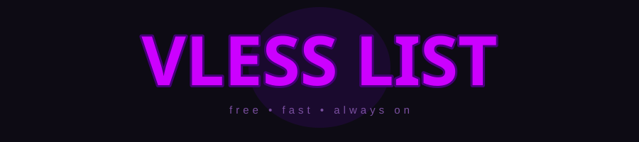

<div align="center">
<br/>



<br/>


<br/>


</div>

<br/>

---

### 🖤 VLESS FREE BLACK

> First list — dark.

```

```

---

### 🤍 VLESS FREE WHITE

> Second list — light.

```

```

---

<div align="center">


</div>

<br/>

---

### ⚠️ Disclaimer

Публичные сервера из открытых источников. Автор не несёт ответственности за стабильность и трафик. **Третьи стороны могут логировать** — используй на свой риск. **Не нарушай закон своей страны.**

---

<div align="center">
<br/>
<sub>by <a href="https://github.com/slxkware">slxkware</a></sub>
<br/><br/>
</div>
